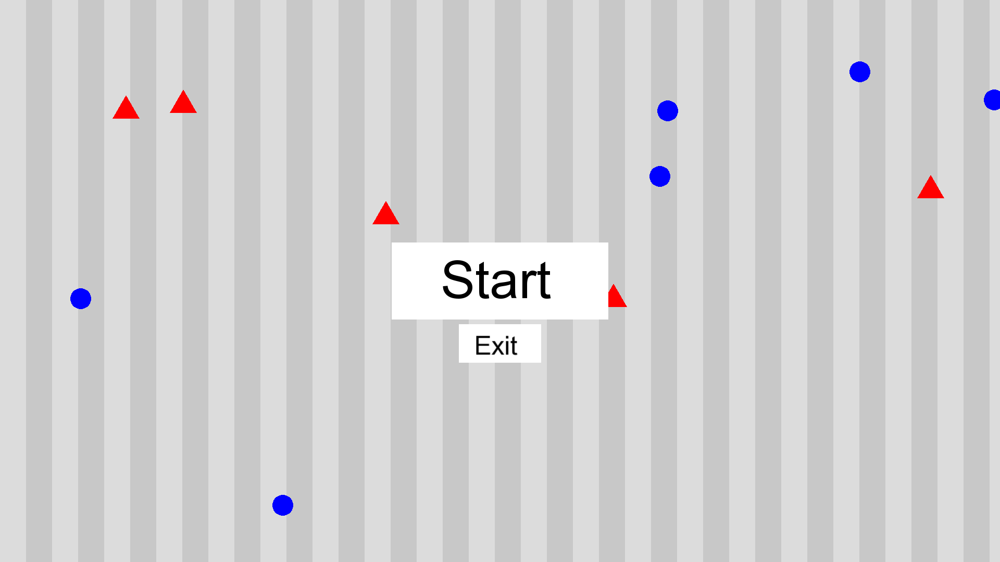
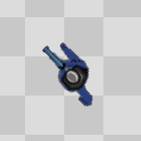
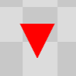
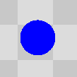
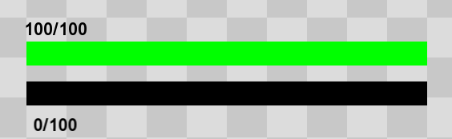
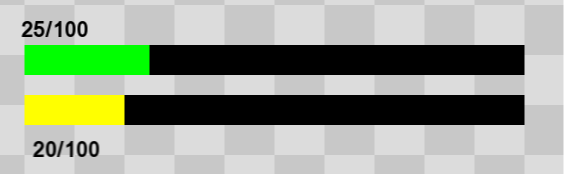

# English

## Geometry Hater

### Description:
Geometry Hater is a fast-paced action game set in a geometric world filled with enemies. The game falls under the genre of arcade shooter.

### Main Game Flow:
- **Start**: The game begins with the main menu screen where players can start the game.

- **Game Process**: Players control a character navigating through a geometric field, encountering various enemy shapes. The player can move using keyboard controls and shoot enemies using the mouse. The goal is to survive as long as possible while defeating enemies and avoiding their attacks.
- **End Conditions**: The game ends when the player's character runs out of health points (HP) due to enemy attacks. Upon death, players can restart the game.
- **Game Interruptions**: Players can pause the game by pressing the 'P' key, which brings up a pause menu. The game can also be exited by pressing the 'Escape' key or closing the game window.

### Available Game Mechanics:
1. **Player Movement**: Players can move their character using the arrow keys or WASD keys.

2. **Shooting Mechanic**: Players can shoot bullets towards enemies by aiming with the mouse cursor and clicking.
3. **Enemy Interaction**: Enemies spawn randomly on the map and move towards the player. Players must dodge enemy attacks while shooting them down.

5. **Health and Experience System**: The player has a health bar (HP) that decreases upon taking damage from enemies. Players gain experience (Exp) by defeating enemies and can level up with enough experience points. Upon reaching a new level, the player's attack speed increases.
6. **UI Elements**: The game features UI elements such as health and experience bars, displayed on the screen to provide player feedback.

7. **Game Audio**: The game includes background music, sound effects for player actions, and potential enemy death sounds.

### Implemented Technical Systems:
1. **High-Level Game Modules**: The game is structured using classes like `Game`, `Player`, `Enemy` and so on, and different enemy subclasses (`CircleEnemy`, `TriangleEnemy`).
2. **NPC Algorithms**: Enemies utilize simple movement and attack algorithms to approach and engage the player character.
3. **Camera Work**: The game implements a camera system that centers on the player character, ensuring they remain in view while navigating the game world.
4. **Procedurally Generated World**: The background grid is rendered in its entirety at once, providing a visually appealing environment for gameplay. This approach allows for a diverse range of textures and patterns without the need to store a large number of resources.
5. **Player Control**: Keyboard and mouse input are utilized for player control, enabling movement and shooting mechanics.
6. **Save Mechanisms**: The game does not appear to include save mechanisms, likely relying on a single-session gameplay experience.
7. **UI Features**: The UI elements, including health and experience bars, are dynamically updated to reflect the player's status during gameplay.

### Future Improvements:
- **Boss Enemies**: Introduce boss enemies with unique attack patterns and increased difficulty levels.
- **Upgrade System**: Implement a system where players can choose upgrades or abilities upon leveling up, enhancing their character's capabilities.
- **Leaderboard**: Add a leaderboard system to track players' best times or scores, providing a competitive element to the game.
- **New Sound Effects**: Include additional sound effects for various in-game actions, such as player movements, enemy attacks, and environmental interactions.
---

# Українаська

## Вороги геометрії

### Опис:
"Вороги геометрії" - це швидкогра аркада, розташована в геометричному світі, наповненому ворогами.

### Основний хід гри:
- **Початок**: Гра починається з головного меню, де гравці можуть розпочати гру.

- **Процес гри**: Гравці керують персонажем, який пересувається через геометричне поле, зустрічаючи різні форми ворогів. Гравець може рухатися за допомогою клавіш управління та стріляти ворогам за допомогою миші. Мета полягає в тому, щоб вижити якомога довше, знищуючи ворогів та уникати їх атак.
- **Умови завершення**: Гра завершується, коли персонаж гравця втрачає всі очки здоров'я (HP) внаслідок атак ворогів. Після смерті гравці можуть перезапустити гру.
- **Переривання гри**: Гравці можуть призупинити гру, натиснувши клавішу 'P', що виведе меню паузи. Гру також можна вийти, натиснувши клавішу 'Escape' або закривши вікно гри.

### Доступні механіки гри:
1. **Рух гравця**: Гравці можуть рухатися своїм персонажем, використовуючи стрілки або клавіші WASD.

2. **Механіка стрільби**: Гравці можуть стріляти кулями у ворогів, наводячи мишкою та клікаючи.
3. **Взаємодія з ворогами**: Вороги випадковим чином з'являються на карті та рухаються до гравця. Гравцям потрібно уникати атак ворогів та одночасно стріляти в них.

4. **Система здоров'я та досвіду**: У гравця є панель здоров'я (HP), яка зменшується при отриманні пошкоджень від ворогів. Гравці отримують досвід (Exp), перемагаючи ворогів, і можуть підняти рівень, отримавши достатню кількість досвіду. При досягненні нового рівня швидкість атаки гравця збільшується.
5. **Елементи інтерфейсу користувача**: Гра має елементи інтерфейсу користувача, такі як панелі здоров'я та досвіду, які відображаються на екрані, щоб надавати повернення гравцю.

6. **Аудіо гри**: Гра включає фонову музику, звукові ефекти для дій гравця та можливі звуки смерті ворогів.

### Плани на майбутнє:
- **Боси**: Введення босів з унікальними атаками та збільшеним рівнем складності.
- **Система покращень**: Реалізація системи, де гравці можуть вибирати покращення або навички під час підняття рівня, покращуючи можливості свого персонажа.
- **Таблиця рекордів**: Додавання системи таблиці рекордів для відстеження найкращих часів або результатів гравців, що надасть конкурентну складову грі.
- **Нові звукові ефекти**: Включення додаткових звукових ефектів для різних дій в грі, таких як рухи гравця, атаки ворогів та взаємодія з оточенням.

### Реалізовані технічні системи:
1. **Модулі гри високого рівня**: Гра структурована за допомогою класів, таких як `Гра`, `Гравець`, `Ворог` та інші, а також різні підкласи ворогів (`CircleEnemy`, `TriangleEnemy`).
2. **Алгоритми NPC**: Вороги використовують прості алгоритми руху та атаки для наближення та взаємодії з персонажем гравця.
3. **Камерна робота**: Гра реалізує систему камери, яка центрується на персонажі гравця, щоб вони залишалися в полі зору під час навігації у світі гри.
4. **Процедурно генерований світ**: Фонова сітка створюється та відображається в повному обсязі одночасно, щоб надати візуально привабливе середовище для гри. Цей підхід дозволяє отримати різноманітні текстури та малюнки без необхідності зберігання великої кількості ресурсів.
5. **Керування гравцем**: Введення клавіатурного та мишкового введення для керування гравцем, що дозволяє використовувати механіку руху та стрільби.
6. **Механізми збереження**: Схоже, що в грі немає механізмів збереження, імовірно, вона розрахована на гру в одній сесії.
7. **Особливості інтерфейсу користувача**: Елементи інтерфейсу, включаючи панелі здоров'я та досвіду, динамічно оновлюються для відображення статусу гравця під час гри.
